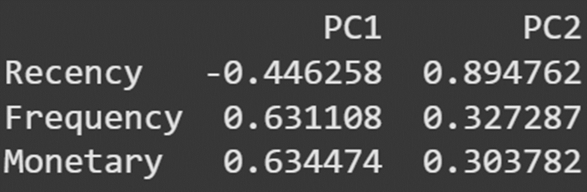
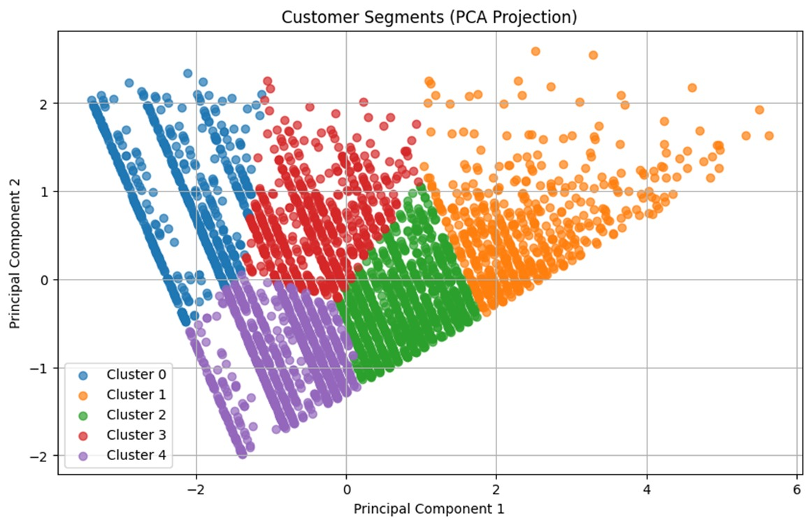
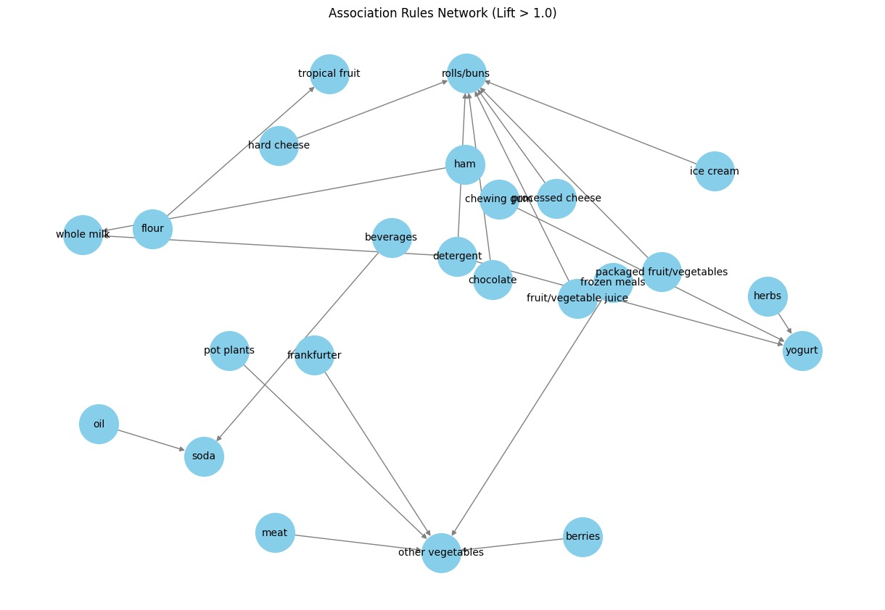
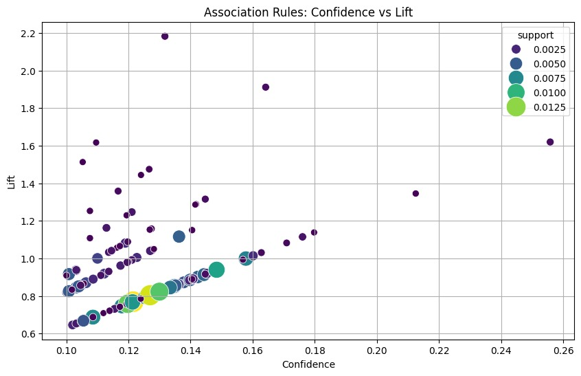
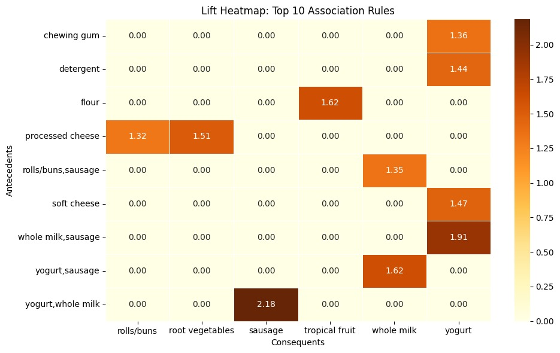

# Customer Segmentation and Basket Affinity Modelling

This project explores customer transaction data to derive actionable business insights through two key analytics tasks:

1. **Customer Segmentation** using RFM (Recency, Frequency, Monetary) analysis combined with K-Means clustering to group customers based on their purchasing behavior
2. **Basket Affinity Modeling** using the Apriori algorithm to discover association rules between items frequently bought together, which can inform product placement, promotions, and recommendations

These techniques together help in understanding customer behavior and tailoring product recommendations, promotions, and store layouts accordingly.


---

## 📑 Table of Contents

- [Project Overview](#project-overview)
- [Notebook Structure](#notebook-structure)
- [Key Steps and Findings](#key-steps-and-findings)
  - [Data Processing](#data-processing)
  - [RFM Analysis](#rfm-analysis)
  - [Principal Component Analysis (PCA)](#principal-component-analysis-pca)
  - [K-Means Clustering](#k-means-clustering)
  - [Basket Affinity Modeling](#basket-affinity-modeling)
- [How to Run the Notebook](#how-to-run-the-notebook)
  
---

## Project Overview

The aim of this analysis is to transform raw retail transaction data into meaningful segments and associations. By segmenting customers based on purchase behavior and uncovering which items are frequently purchased together, businesses can target promotions, optimize inventory, and personalize marketing strategies.

---


## Notebook Structure

The notebook is structured into the following main sections:

-   **Data Processing**: This section covers importing the dataset, initial data exploration, and handling missing values.
-   **RFM Analysis**: This section focuses on calculating Recency, Frequency, and Monetary values for each customer.
-   **PCA (Principal Component Analysis)**: This section applies PCA to reduce the dimensionality of the RFM features for easier visualization and potentially improved clustering performance.
-   **K-Means Clustering**: This section implements K-Means clustering on the RFM (or PCA-transformed RFM) data to group customers into distinct segments, including finding the optimal number of clusters.
-   **Basket Affinity Modelling**: This section prepares the data for association rule mining and applies the Apriori algorithm to find frequent itemsets and generate association rules.

## Key Steps and Findings

### Data Processing

- **Data Loading**: The dataset was downloaded directly from Kaggle using the `kagglehub` library and loaded into a pandas DataFrame.
- **Initial Exploration**: Basic data exploration was performed using `.info()`, `.describe()`, and `.isnull().sum()` to understand the dataset structure, summary statistics, and check for missing values. The dataset was found to have no missing values.
- **Date Conversion**: The 'Date' column was converted to datetime objects to facilitate time-based calculations for RFM analysis.

### RFM Analysis

RFM analysis was conducted to segment customers based on their transactional behavior.
- **Recency**: Calculated as the number of days between each customer's last purchase date and the most recent date in the dataset.
- **Frequency**: Computed as the number of unique purchase dates for each customer.
- **Monetary**: Determined by counting the total number of items purchased by each customer.
These three metrics were combined into a single DataFrame `rfm`.

### PCA (Principal Component Analysis)

- **Purpose**: PCA was applied to the scaled RFM data to reduce its dimensionality to two principal components (PC1 and PC2) while retaining most of the original variance. This is useful for visualizing the customer segments in a 2D space.
- **Explained Variance**: The explained variance ratio showed that PC1 captures the majority of the variance in the RFM data, and PC2 captures a significant portion of the remaining variance. This indicates that the two components effectively represent the underlying patterns in the RFM metrics.
- **Feature Contributions**: The PCA weights revealed how much each original RFM feature (Recency, Frequency, Monetary) contributes to the principal components. For instance, PC1 is heavily influenced by Frequency and Monetary values (both with positive weights), while PC2 is strongly related to Recency (with a positive weight).

This figure illustrates how the original RFM features contribute to the two principal components. It helps interpret which features dominate each component.


### K-Means Clustering

- **Optimal K**: The Elbow method (plotting Inertia vs. K) and Silhouette scores were used to determine the optimal number of clusters. Based on the Silhouette scores, K=5 was selected as the best number of clusters for the dataset, as it yielded the highest score among the evaluated range.
- **Model Fitting and Visualization**: A K-Means model with 5 clusters was fitted to the scaled RFM data (or PCA-transformed data). Cluster labels were assigned to the `rfm` and `pca_df` DataFrames. The clusters were visualized on the PCA-transformed data, showing visually distinct groupings of customers.
- **Cluster Profiling**: The mean RFM values were calculated for each cluster (`cluster_profile`). This analysis helps to understand the characteristics of each segment. For example, clusters with low Recency and high Frequency/Monetary values represent recent, frequent, and high-spending customers (likely the most valuable segment), while clusters with high Recency and low Frequency/Monetary values represent dormant or low-value customers.

Customers are projected onto the 2D PCA space and colored by their cluster label. This provides a clear view of how K-Means separated customer behavior patterns.



- ### Basket Affinity Modelling

- **Data Transformation**: The transaction data (customer number, date, and item description) was transformed into a one-hot encoded format where each row represents a transaction (customer and date combination) and each column represents a unique item, indicating whether that item was present in the transaction.
- **Frequent Itemsets**: The Apriori algorithm was applied to the encoded transaction data with a `min_support` of 0.001 to find items or sets of items that frequently appear together in transactions.
- **Association Rules**: Association rules were generated from the frequent itemsets using a `min_threshold` of 0.1 for the `confidence` metric. The `lift` metric was used to evaluate the strength and relevance of the rules. Rules with a lift greater than 1 indicate that the items in the consequent are more likely to be bought when the items in the antecedent are also bought, compared to their individual probabilities.

  
  
- **Rule Interpretation**: The scatter plot of confidence vs. lift visualizes the trade-off between these two metrics and the support of the rules.

  

  The heatmap of the top rules sorted by lift provides a clear visual representation of the strongest associations between specific item sets. For instance, a high lift value between "sausage" and "yogurt" suggests that customers buying sausage are significantly more likely to also buy yogurt.
  
  
- **Interactive Consequent Finder**: An interactive widget was created to allow users to select one or more items and find the associated items (consequents) based on the generated rules, along with their support, confidence, and lift values.


## How to Run the Notebook

1.  **Obtain the Data**: The dataset is available on Kaggle. The notebook uses the `kagglehub` library to download the dataset directly. Ensure you have a Kaggle account and the necessary credentials configured for `kagglehub` to work. The data file used is `Groceries data.csv`.

2.  **Install Dependencies**: The notebook requires the following Python libraries. You can install them using pip:
    ```bash
    pip install pandas numpy matplotlib scikit-learn mlxtend kagglehub seaborn ipywidgets networkx
    ```

3.  **Execute the Notebook**: You can run this notebook using Jupyter Notebook or JupyterLab. Simply open the `.ipynb` file in either environment and run the cells sequentially.


